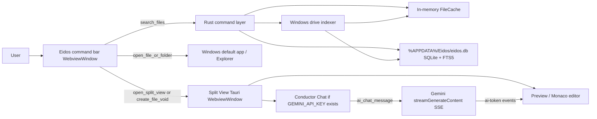

# Eidos Engineering Handover

Last updated: June 21, 2026

## 1. Product summary

Eidos is a Windows-only native desktop search and file-assistance app built with Tauri 2, Rust, and SvelteKit.

The current implementation has two native Tauri windows:

1. `spotlight` — the internal label for a frameless Eidos command bar positioned 100 px from the top of the primary monitor and toggled with `Ctrl+Space`.
2. `main` — a decorated Split View window that opens for preview/editing or Void file creation.

The application is not a web app. The UI is rendered inside Tauri WebView2 windows with no browser chrome, no default context menu, and production devtools disabled in `tauri.conf.json`.

## 2. Current deliverable status

The project currently builds successfully to a Windows MSI:

```text
src-tauri/target/release/bundle/msi/Eidos_1.0.0_x64_en-US.msi
```

Verification completed:

- `npm run check` — 0 errors, 0 warnings
- `npm run build` — success
- `cargo check` — success, warning-clean
- `cargo test` — 1 test passed
- `npm run tauri build` — success, produced MSI

Note: `npm install --package-lock-only --legacy-peer-deps` reported two low-severity npm advisories in the JavaScript dependency tree. They do not block the current build.

## 3. High-level architecture



## 4. Windows-only decisions

The Rust backend is intentionally Windows-only:

- `src-tauri/src/main.rs` is guarded with `#![cfg(target_os = "windows")]`.
- `src-tauri/src/indexer.rs` has a non-Windows `compile_error!`.
- Fixed drive discovery uses Win32 APIs through the `windows` crate:
  - `GetLogicalDrives`
  - `GetDriveTypeW`
- The command bar uses Windows acrylic through `window-vibrancy`.
- The bundle target is MSI only.

There are no macOS/Linux runtime paths in the current Rust implementation.

## 5. Important files

### Native backend

- `src-tauri/src/main.rs`
  - Tauri builder setup
  - plugin registration
  - global `Ctrl+Space`
  - tray menu
  - window positioning/acrylic
  - `%APPDATA%\Eidos` database location
  - initial DB-to-memory-cache hydration

- `src-tauri/src/state.rs`
  - shared `AppState`
  - SQLite connection
  - in-memory cache
  - indexing guard
  - Gemini key
  - stream abort handles
  - tray/watchers

- `src-tauri/src/cache.rs`
  - in-memory file suggestion cache
  - drive-keyed record buckets
  - prefix/contains/path-segment matching
  - update/remove hooks for writes and watcher changes

- `src-tauri/src/db.rs`
  - SQLite schema
  - FTS5 table/triggers
  - migration from older `source` schemas
  - batch sync/upsert/delete
  - FTS fallback search

- `src-tauri/src/indexer.rs`
  - fixed-drive discovery
  - `jwalk` traversal
  - Windows hidden/system filtering
  - excluded directory patterns
  - batch DB/cache population
  - optional `notify` watchers

- `src-tauri/src/commands.rs`
  - all Tauri commands exposed to Svelte
  - search/open/split-view/file read/write
  - image/PDF data URLs
  - folder listing
  - Gemini command entrypoints

- `src-tauri/src/ai.rs`
  - Gemini 3.1 Flash Lite streaming
  - SSE parsing
  - `ai-token`, `ai-stream-start`, `ai-stream-end` events
  - abort support

### Frontend

- `src/spotlight/SpotlightApp.svelte`
  - command-bar mini-app wrapper
  - theme detection
  - blocks context menu and devtools shortcuts

- `src/lib/SpotlightBar.svelte`
  - launcher input
  - 100 ms debounce
  - result dropdown
  - open default vs Split View behavior
  - Void creation flow
  - indexing progress UI

- `src/lib/StudioWindow.svelte`
  - main Split View shell
  - event listeners for `open-split-view` and AI streams
  - hides chat when Gemini is unavailable

- `src/lib/PreviewPane.svelte`
  - dynamic preview:
    - Monaco for text/code
    - `` for images
    - `iframe` data URL for PDFs
    - folder listing
    - metadata card for unknown binaries
    - editable missing-file view for Void output

- `src/lib/EditorPane.svelte`
  - Monaco AMD loader integration through `@monaco-editor/loader`
  - offline Monaco path: `/monaco/vs`
  - append-token API for streaming text

- `src/lib/ChatPane.svelte`
  - Conductor chat
  - sends messages
  - stop generation
  - accepts drag/drop path context if used by future tree UI

- `src/lib/FileCard.svelte`
  - unknown/binary/missing-file metadata view

- `src/lib/stores/studio.ts`
  - Split View state store

## 6. Window behavior

### Eidos command bar

Configured in `src-tauri/tauri.conf.json`:

- label: `spotlight`
- URL: `spotlight.html`
- `decorations: false`
- `transparent: true`
- `alwaysOnTop: true`
- `skipTaskbar: true`
- `devtools: false`

Positioning is done in Rust in `position_spotlight()`, using the primary monitor dimensions. The command bar is resized by the frontend as results appear.

### Split View

Configured as:

- label: `main`
- URL: `index.html`
- hidden at startup
- native decorations enabled
- resizable/maximizable
- `devtools: false`

`open_split_view` shows, maximizes, focuses the main window, hides the command bar, and emits `open-split-view`.

## 7. Search and indexing flow

The intended performance model is:

1. On startup, Eidos opens `%APPDATA%\Eidos\eidos.db`.
2. Existing DB rows are loaded into `FileCache`.
3. No full drive crawl happens at startup.
4. First non-empty search:
   - if cache has data, results return from memory;
   - if cache is empty, a background fixed-drive index starts and the search returns no results immediately;
   - UI shows indexing progress.
5. `index_drives` can also be invoked manually.
6. Indexed records are written to SQLite in a single exclusive transaction and copied into memory.

The cache searches:

- exact filename
- filename prefix
- filename contains
- matching path segments, so a folder-name query can surface files inside that folder
- path contains

FTS5 is retained for deeper/special searches but is no longer the primary autocomplete path.

## 8. Database

Database path:

```text
%APPDATA%\Eidos\eidos.db
```

Schema:

```sql
CREATE TABLE IF NOT EXISTS files (
    id INTEGER PRIMARY KEY AUTOINCREMENT,
    path TEXT UNIQUE NOT NULL,
    filename TEXT NOT NULL,
    extension TEXT NOT NULL DEFAULT '',
    size INTEGER NOT NULL DEFAULT 0,
    modified_timestamp INTEGER NOT NULL DEFAULT 0,
    is_directory INTEGER NOT NULL DEFAULT 0,
    metadata TEXT DEFAULT '{}'
);

CREATE VIRTUAL TABLE IF NOT EXISTS files_fts USING fts5(
    filename,
    extension,
    path,
    tokenize='unicode61'
);
```

Triggers keep `files_fts` synchronized with `files`.

The migration path handles older schemas that had a `source` column by recreating `files` with the local-only structure.

## 9. Tauri commands

Current command surface:

- `search_files(query)`
- `index_drives()`
- `open_file_or_folder(path)`
- `open_split_view(path)`
- `create_file_void(desiredPath)`
- `get_pending_split_view()`
- `ai_available()`
- `read_file_content(path)`
- `file_data_url(path)`
- `list_folder(path)`
- `get_file_metadata(path)`
- `write_file(path, content)`
- `ai_chat_message(filePath, message)`
- `abort_ai(streamId?)`
- `return_to_spotlight()`
- `hide_spotlight()`
- `rebuild_search_index()`
- `cache_size()`
- `refresh_file_in_index(path)`

## 10. Gemini integration

Gemini is optional and controlled only by:

```text
GEMINI_API_KEY
```

If missing:

- chat pane is hidden;
- `create_file_void` returns a clear error;
- search/open/preview/edit still work.

If present:

- model: `gemini-3.1-flash-lite`
- endpoint:

```text
https://generativelanguage.googleapis.com/v1beta/models/gemini-3.1-flash-lite:streamGenerateContent?alt=sse&key={key}
```

SSE parsing extracts:

```text
candidates[0].content.parts[0].text
```

Events:

- `ai-stream-start`
- `ai-token`
- `ai-stream-end`

Cancellation:

- frontend calls `abort_ai`
- backend sends a oneshot abort signal and cleans up the stream handle

## 11. Build configuration

Key config files:

- `src-tauri/tauri.conf.json`
  - `frontendDist: ../build`
  - `devUrl: http://localhost:5173`
  - `bundle.targets: msi`

- `vite.config.ts`
  - SvelteKit
  - Monaco static copy to `build/monaco/vs`
  - Chrome/WebView2 build target

- `svelte.config.js`
  - static adapter
  - fallback `index.html`

Build command:

```powershell
npm run tauri build
```

## 12. Installation artifact

The current MSI path is:

```text
C:\Users\mrnad\OneDrive\Documents\AI Spotlight\src-tauri\target\release\bundle\msi\Eidos_1.0.0_x64_en-US.msi
```

The native executable path from the release build is:

```text
C:\Users\mrnad\OneDrive\Documents\AI Spotlight\src-tauri\target\release\eidos.exe
```

## 13. Known limitations and honest caveats

- The “scan 1 TB in under 10 seconds” goal depends heavily on hardware, permissions, antivirus, path count, and disk temperature. The current implementation uses a fast parallel strategy, but no software can guarantee that target on every machine.
- PDF preview currently uses WebView2’s ability to render a `data:application/pdf` iframe. It is not a full custom PDF.js UI.
- There is no Settings page yet. The tray has a Settings menu item that opens the main window and emits `open-settings`, but no dedicated settings component consumes it yet.
- Start-with-Windows is not implemented yet.
- MSI shortcut customization uses Tauri’s default bundler behavior. If explicit desktop shortcut control is mandatory, add WiX customization in `tauri.conf.json` after validating against the Tauri 2 schema.
- `notify` watchers are installed after a successful index. The main correctness path is still manual/on-demand indexing plus writes updating the cache.
- The UI still contains legacy `Sidebar`/`TreeNode` components as local-only compatible components, but the active Split View no longer renders the sidebar.

## 14. Recommended next work

1. Add a real Settings view:
   - Gemini key instructions
   - Index Now button
   - excluded path management
   - start-with-Windows toggle

2. Add explicit WiX shortcut configuration and verify installed Start Menu/Desktop behavior on a clean VM.

3. Add integration tests for:
   - cache search ranking
   - DB migration
   - file write → DB/cache update
   - Void flow with mocked Gemini SSE

4. Add a small smoke-test script that launches the release EXE, checks windows are created, then exits.

5. Consider a custom PDF.js viewer only if PDF workflows become central.

6. Add binary size auditing. Current release uses Tauri/WebView2 and Monaco assets, so the “under 15 MB” target may require aggressive feature pruning.

## 15. Day-one runbook

Fresh machine:

```powershell
git clone <repo>
cd "AI Spotlight"
npm install --legacy-peer-deps
npm run check
npm run tauri build
```

Optional AI:

```powershell
[Environment]::SetEnvironmentVariable("GEMINI_API_KEY", "your_key", "User")
```

Then restart Eidos so Rust sees the environment variable.

If the command bar is hidden:

```text
Ctrl+Space
```

If search returns nothing on first use, wait for indexing progress. First search intentionally starts indexing on demand.
